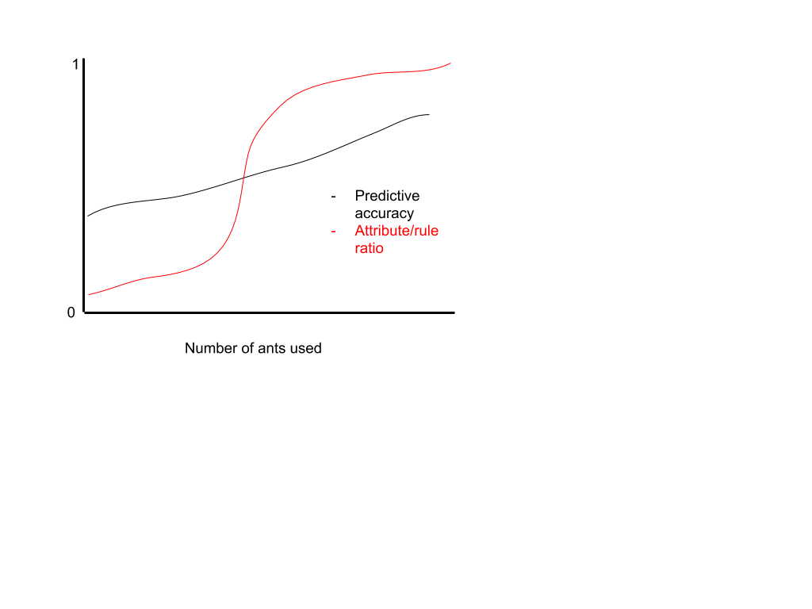

##### Classification in Data-Mining using an ant-Colony Agent-Based Model Algorithm. 
 
Nathan Lepore and Jon Zerez
 
We plan to investigate the data mining power of an ant colony agent-based model. 
Ultimately we plan to classify sets of data using a series of ant agents that will 
create sets of rules to use to classify different classes within the data. Data mining 
has several steps: classification, regression, clustering, dependence modeling, and more. 
We are specifically focusing on the classification of data. The classification step 
is about assigning each object in a set of data to a class from a set of predefined classes.
Our approach will use agents to traverse the space of all possible rules, and identify the rules 
that lead to the most effective method of classification. 
We will be using public-domain data sets for testing and agent-based modeling to approach this problem. 
 
Data mining with an ant colony optimization algorithm 
R.S. Parpinelli, H.S. Lopes, A.A. Freitas, IEEE Transactions on Evolutionary Computation, Column: 6 Issue: 4 
https://ieeexplore.ieee.org/stamp/stamp.jsp?tp=&arnumber=1027744
This paper proposes the strategy of using an ant-colony like method for data mining.
They experiment with a singular implementation that includes the ants, a heuristic function
to calculate effectiveness of the ants, a pheromone trail that acts as a positive feedback loop 
to promote shortest-path (most optimal) behavior, and “rule pruning” which is a way to simplify 
the classification as to not overfit the data and make it more readable by people. 
They are comparing their ant model to CN2 which is a more standard data mining classification algorithm. 
Their primary conclusions are that their ant-miner works as well as CN2 from a predictive accuracy metric, 
but the ant-miner approach achieves that level of accuracy using far fewer rules. 
This is useful because ultimately people will be interpreting the results and having fewer rules increases the 
comprehensibility of the algorithm’s results. 
 
If we can get access to the same data they used, we will replicate the implementation of the ant on the same data sets
to try and replicate their results. We are then hoping to extend this to an implementation of the faces module from QEA
to try and classify faces using an agent to create rules and using those rules to guess classifications of people. 
Another potential extension is to try and optimize the algorithm based on a few paraments the algorithm uses, 
including the maximum number of ants to create, the weight of pheromone trails, and the maximum amount of allowable uncovered cases.
In this case we might look at the predictive accuracy and the ratio between the total number of attributes and number of rules. 
This would inform how well the algorithm was finding important attributes.
A potential plot if we chose to try and optimize the algorithm might compare the number of ants used to the predictive accuracy
of the model, as well as how well it is maintaining the ratio between attributes and created rules. 
It might look something like the plot below.

If we plot predictive accuracy vs ratio of attributes to rules, we might find that there is a critical ratio that causes
the most accuracy, and trying to overcomplicate the rules after that point leads to diminishing returns.  
 
There are potential pitfalls if we try to expand into other types of data for classification.
For the faces extension it gets into a concerning area where in their implementation the rules require complete
discretization of attributes,  but for useful face pictures we would need a continuous space of attributes (pixel shade).
We would probably try doing it with a really high contrast image that only has black or white pixels, 
then if that didn’t work we could try to implement a continuous attribute space.
However this would be a very large extension and is something the authors of the paper said they would attempt as an extension. 
 
Our current plan is as follows

Team goals: 
- More in-depth understanding of the paper and how to implement it
- Understanding the entropy based metaheuristic for constructing paths/rulesets
- Understanding rule pruning
- Try to get a first-pass model working by next Friday on really simple data
	
